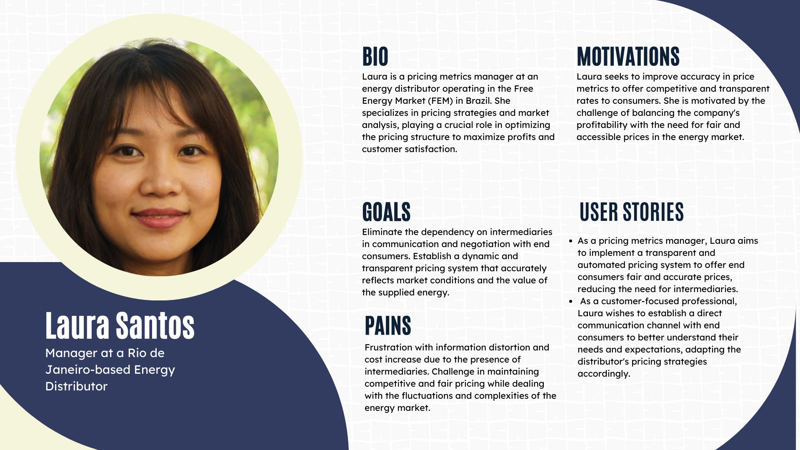

## BaoEnergy
#### Members:
- <a href="https://www.linkedin.com/in/davi-motta/">Davi Motta</a>
- <a href="https://www.linkedin.com/in/erik-batista-da-silva-455612215/">Erik Batista</a>
- <a href="https://www.linkedin.com/in/nicollas-isaac/">Nicollas Isaac</a>
- <a href="https://www.linkedin.com/in/rafaella-bianca-cavalcante/">Rafaella Cavalcante</a>
- <a href="https://www.linkedin.com/in/yan-m-coutinho/">Yan Coutinho</a>

## Summary

[1. Introduction](#c1)

[2. Objectives and Justification](#c2)

[3. Market Analysis and Development](#c3)

[4.Technologies Utilized](#c4)

[5. Conclusions and Next Steps](#c6)

[6. References](#c7)

## 1. Introduction
&emsp;This documentation introduces an innovative blockchain application specifically developed to transform the way users access the Free Energy Market (FEM) in Brazil. Our solution aims not only to facilitate the entry of consumers and businesses into this dynamic and economic market but also to significantly reduce the costs associated with energy supplier contracting.

&emsp;Using cutting-edge technologies like ChainLink, Hardhat, Next.js, Scaffold, and Scroll, our blockchain platform offers a decentralized ecosystem that allows direct negotiation between energy consumers and suppliers. With this, we intend to disintermediate the contracting process in the FEM, removing traditional barriers and decreasing the fees that currently burden the participants of this market.

## 2. Objectives and Justification

### 2.1 General Objectives

The blockchain solution for the Free Energy Market (FEM) has the general objective of streamlining and democratizing access to energy, aiming for a more competitive, transparent, and efficient market. This initiative seeks to facilitate the entry of new consumers and companies into the FEM, minimizing barriers and transaction costs. Additionally, it aims to promote direct negotiation between energy consumers and suppliers, removing intermediaries and ensuring security and transparency in transactions through blockchain technology. The proposed system is decentralized and autonomous, reducing energy costs for consumers and increasing market competitiveness by encouraging the entry of new suppliers. Promoting energy sustainability through the encouragement of renewable energy consumption is also among the main objectives of the platform.

### 2.2 Specific Objectives

To achieve these general objectives, the blockchain solution for the FEM aims to:

1. **Facilitate consumer access to the FEM:** Consumers will be able to register their monthly energy consumption on the platform, which will then recommend suitable suppliers to their needs and display the average prices of corresponding energy plans. This will facilitate comparison of options and provide a simplified and efficient purchasing process.

2. **Reduce energy costs for consumers:** The platform will eliminate intermediaries, reducing fees and allowing direct negotiations for better prices and conditions.

3. **Promote transparency in the energy market:** All transactions will be recorded on the blockchain, ensuring an immutable record and providing detailed information about the origin and type of energy consumed, as well as enabling the evaluation of supplier performance.

4. **Increase market competitiveness in the energy market:** The solution will encourage the entry of new suppliers and the diversification of the energy matrix, fostering the generation and consumption of renewable energy, which will contribute to a more competitive market.

5. **Encourage energy sustainability:** The platform will promote the use of renewable energy through special tariffs and incentives, educating consumers about their benefits and promoting conscious consumption practices to reduce environmental impact.

### 2.3 Justification

&emsp;The implementation of the BaoEnergy solution in Brazil's Free Energy Market (FEM) is justified by the urgent need to make the energy market more accessible, economical, and sustainable. The current FEM faces significant challenges in transparency and efficiency, with consumers and companies often burdened by high costs and bureaucratic processes in energy contracting. The lack of transparency in prices and contracting processes creates an environment conducive to inefficiencies and potentially unfair practices.

&emsp;BaoEnergy, with its blockchain-based approach, proposes a structural reform in this scenario. By disintermediating the energy contracting process, a significant layer of costs and complexity is eliminated, allowing consumers and suppliers to interact directly in a secure and transparent environment. This direct access will not only reduce energy costs for consumers but also increase market competitiveness by encouraging the entry of new suppliers and the adoption of renewable energies.

&emsp;Additionally, the solution aligns with global sustainability goals, promoting the use of renewable energy sources and supporting the energy transition to a cleaner, greener model. At a time when the climate crisis demands concrete and innovative actions, BaoEnergy represents a significant step towards a more sustainable and fair energy future.

&emsp;Therefore, the justification for this project goes beyond efficiency and savings, embracing values of sustainability, equity, and transparency. This not only meets the immediate demand for improvements in the FEM but also positions the Brazilian energy sector at the forefront of innovation and socio-environmental responsibility.

&emsp;Thus, BaoEnergy aims to not only streamline and democratize access to the FEM but also to foster a more competitive, transparent, and sustainable energy market in Brazil, reinforcing a commitment to sustainability and social responsibility.

### 2.4 Solution Proposal

BaoEnergy proposes an innovative blockchain solution to reshape access to the Free Energy Market (FEM) in Brazil. Our approach aims to simplify the entry of consumers and companies into this market by offering a decentralized platform that allows direct negotiation between energy consumers and suppliers, eliminating intermediaries and reducing costs.

#### Features and Benefits:

- **Advanced Technology:** Using tools like ChainLink, Hardhat, Next.js, Scaffold, and Scroll, BaoEnergy offers a robust and secure system that ensures transaction transparency and efficiency.
- **Facilitated Access:** Through monthly energy consumption registration, the platform recommends suitable suppliers and displays average prices, facilitating consumer decision-making.
- **Cost Reduction:** The elimination of intermediaries in the FEM contracting process enables significant savings in fees, making energy more accessible to everyone.
- **Total Transparency:** With all transactions recorded on the blockchain, we ensure an immutable and transparent system, where the origin and type of energy are clearly stated.
- **Competitive Market:** The platform encourages the entry of new suppliers and promotes energy diversification, contributing to a more competitive and sustainable market.
- **Commitment to ESG:** BaoEnergy is committed to Environmental, Social, and Governance (ESG) practices, encouraging the use of renewable energy and promoting an ethical and responsible business model aligned with sustainable development goals.
The proposal of BaoEnergy is not only technologically advanced but also aligned with the need for a fair, economical, and sustainable energy market in Brazil, reinforcing a commitment to sustainability and social responsibility.

## 3. Market Analysis and Development

### 3.1 Industry Context

&emsp;In Brazil, the Free Energy Market (FEM) is at a crucial point of transformation, offering an alternative to the regulated market, where large consumers can negotiate energy directly with suppliers, seeking more advantageous and flexible conditions. Despite its potential to increase competitiveness and efficiency, the FEM faces challenges such as the need for greater transparency, inclusion, and technological innovation.

&emsp;The adoption of disruptive technologies, such as blockchain, promises to revolutionize this market, offering more efficient processes, reduced costs, and enhanced transparency and reliability in transactions. The growing focus on Environmental, Social, and Governance (ESG) practices is also shaping the market, demanding strategies that align economic growth with environmental sustainability.

&emsp;In this scenario, BaoEnergy emerges as an agent of innovation, using blockchain to facilitate access to the FEM, minimize existing barriers, and foster a more equitable and sustainable energy environment. BaoEnergy's platform aims to meet current demands for greater efficiency and transparency, while also leading the transition to a more renewable and sustainable energy model, aligned with global sustainable development goals and the requirements of the Brazilian energy market.

### 3.2 Porter's Five Forces Analysis

&emsp; Porter's Five Forces analysis is a useful tool for understanding the competitive dynamics of a specific industry or market. Let's apply it to the context of the Free Energy Market (FEM) in Brazil, considering BaoEnergy's proposal and its potential impact:

### 1. Rivalry among existing competitors:

- **Low:** Currently, the FEM in Brazil is dominated by a few large energy companies, but entry of new participants is relatively easy due to regulations allowing direct negotiation between consumers and suppliers. With the introduction of BaoEnergy, which proposes a decentralized and transparent blockchain-based platform, competition may intensify as new suppliers are encouraged to enter the market. However, BaoEnergy's innovative approach may differentiate it enough to reduce direct rivalry.

### 2. Bargaining power of suppliers:

- **Moderate to Low:** With the introduction of a platform like BaoEnergy, which promotes direct negotiation between consumers and suppliers, the bargaining power of suppliers may decrease. This is because the platform offers an environment where suppliers compete more directly with each other, reducing consumers' reliance on specific suppliers and increasing price transparency.

### 3. Bargaining power of buyers:

- **High:** Buyers (consumers and businesses) in the FEM typically have high bargaining power due to the ability to negotiate directly with suppliers. With the introduction of BaoEnergy, which aims to further increase transparency and facilitate direct negotiation, this bargaining power may further increase as consumers have access to more information and options to choose from.

### 4. Threat of new entrants:

- **Moderate:** Entry into the energy market is regulated, but the Brazilian FEM allows entry of new participants, especially with innovative proposals like BaoEnergy. However, the need for initial capital and technological complexity may pose significant barriers to new entrants. The established reputation of large energy companies may also act as a barrier to new participants.

### 5. Threat of substitute products or services:

- **Low:** In the context of the FEM, substitute products or services are limited, as energy is a basic necessity and there are no direct alternatives to electricity in the market. However, the threat may arise from regulatory changes that could impact the viability of the FEM as a whole.

### Conclusion:

&emsp; The introduction of BaoEnergy into the Brazilian Free Energy Market (FEM) has the potential to significantly alter the competitive dynamics of the sector. By promoting transparency, reducing entry barriers, and facilitating direct negotiation between consumers and suppliers, the platform can increase competition and benefit consumers. However, challenges such as the need to build trust in the new model and overcome resistance from established companies may influence the intensity of competition in the market.

### 3.3 SWOT Analysis

### SWOT Analysis

&emsp; The SWOT analysis (Strengths, Weaknesses, Opportunities, Threats) is a useful tool for understanding the strengths, weaknesses, opportunities, and threats of a project, product, or company. Let's conduct a SWOT analysis for BaoEnergy's proposal in the context of the Free Energy Market (FEM) in Brazil:

### Strengths:
1. **Advanced Technology:** Utilization of cutting-edge technologies like blockchain to ensure security, transparency, and efficiency in transactions.
2. **Disintermediation:** Removal of intermediaries in the energy contracting process, reducing costs and complexity for consumers and suppliers.
3. **Cost Reduction:** Significant decrease in costs associated with hiring energy suppliers, making the market more accessible.
4. **Promotion of Sustainability:** Encouragement of renewable energy usage, aligning with global sustainability and environmental responsibility trends.
5. **Transparency:** Recording of all transactions on the blockchain, ensuring an immutable and transparent system.

### Weaknesses:
1. **Technological Complexity:** Adoption of technologies like blockchain may be complex for some users and companies, requiring an adaptation period.
2. **Dependency on Adoption:** The platform's success depends on widespread adoption by consumers and suppliers, which can be challenging initially.
3. **Requires Internet Connection:** Platform usage may be limited in areas with limited internet access, excluding potential users.

### Opportunities:
1. **Growing Market:** The Free Energy Market in Brazil is expanding, offering opportunities for new players and technological innovations.
2. **Environmental Awareness:** Increasing concern about environmental issues may increase demand for renewable energy, benefiting BaoEnergy's proposal.
3. **Favorable Regulation:** Regulatory changes promoting transparency and competition in the energy market can drive the adoption of solutions like BaoEnergy.

### Threats:
1. **Established Competition:** Large established energy companies may see BaoEnergy's proposal as a threat and seek ways to maintain their dominant position in the market.
2. **Resistance to Change:** Consumers and businesses may resist the adoption of new technologies and business models, especially if they are already satisfied with their current suppliers.
3. **Regulatory Instability:** Frequent changes in policies and regulations in the energy sector can impact the viability and stability of the platform.

### Conclusion:
&emsp; The SWOT analysis shows that BaoEnergy's proposal has several strengths and opportunities that can drive its success in the Free Energy Market. However, it is important to be aware of the weaknesses and threats and develop strategies to mitigate these challenges. With a strategic and adaptive approach, BaoEnergy can position itself competitively and significantly contribute to the transformation of the energy market in Brazil.

### 3.5 Personas & User Stories 

&emsp;Both personas and user stories play crucial roles in building a Minimum Viable Product (MVP). Personas provide a deep understanding of target users, helping development teams focus on the most relevant and meaningful features and functionalities for these users. This is essential to ensure that the MVP meets the real needs of the market and customers from the outset.

&emsp;User stories, on the other hand, detail specific product functionalities from the user's perspective, which is fundamental to the agile development process. They guide the team in prioritizing tasks and defining the MVP scope, allowing development to occur iteratively and focused on user needs.

&emsp;Therefore, both personas and user stories play a crucial role in identifying, defining, and prioritizing MVP requirements, ensuring that it is viable, user-centered, and capable of delivering value from the initial launch. For this reason, two personas were created that delineate the target audiences of our solution, one being a Manager of an energy distribution company operating in the Free Energy Market (FEM), and the other being a Director of Facilities of a company contracting energy through the FEM.

 
Figure 03 - Consumer Persona  
</img>
Source: Developed by the authors.

 
Figure 04 - Distributor Persona  
</img>
Source: Developed by the authors.

### 3.5 Value Proposition Canvas

&emsp;The Value Proposition Canvas is a strategic tool used to develop and analyze the value proposition of a product or service. Created by Alex Osterwalder, the canvas helps ensure that a company's offering is aligned with customers' expectations and needs.

&emsp;The canvas is divided into two main parts: the customer profile and the value proposition. The customer profile focuses on understanding the jobs the customer needs to do, the pains they want to alleviate, and the gains they seek to achieve. On the other hand, the value proposition focuses on the products and services a company offers, highlighting how they alleviate customer pains and create desired gains. With this in mind, two Value Proposition Canvases were built to demonstrate the value generated for the two personas of the project. The first of these demonstrates the value added to the consumer, while the second, to the energy distributor in the Free Energy Market.

 
Figure 01 - Value Proposition Canvas - Consumer Persona  
</img>
Source: Developed by the authors.

 
Figure 02 - Value Proposition Canvas - Distributor Persona  
</img>
Source: Developed by the authors.

&emsp;Considering the Canvases presented above, it becomes evident that BaoEnergy presents an innovative proposition for the Free Energy Market (FEM) in Brazil, with a blockchain platform that promotes direct connection between consumers and energy suppliers. This solution aims to eliminate intermediaries, making the process more efficient and economical. The emphasis on price transparency and the presence of renewable energy indicators highlight a commitment to sustainability and ESG practices.

&emsp;The platform allows consumers to register their energy consumption and receive personalized supplier recommendations, along with information on the average kWh price, facilitating purchasing decisions based on concrete data. Additionally, the possibility of using DREX for payments further simplifies the process, avoiding additional bank fees.

&emsp;BaoEnergy targets both quantifiable gains, such as cost reduction and increased sales efficiency, and intangible benefits, such as improved market perception and ease of access to clean energy. At the same time, the solution aims to alleviate common pains of FEM participants, such as high operating costs and complexity in energy negotiation and contracting.

&emsp;In summary, BaoEnergy positions itself as a change agent in the Brazilian FEM, offering a solution that not only improves market efficiency and transparency but also aligns it with contemporary demands for sustainability and corporate responsibility.

## 4. Technologies Utilized

During the creation of this project, technologies such as Scaffold from BuildGuild, Scroll, and Chainlink were utilized. Scaffold was used to facilitate the integration of smart contracts with the front-end. Upon deploying the Smart Contract, this tool generates functions capable of connecting it to a front-end also automatically created. Furthermore, to enhance the user experience, the front-end generated by Scaffold was refactored to make it more consistent and suitable for what our solution aims to offer to the user as an experience.

Regarding Chainlink, its functions were used to obtain and monitor the electricity meter data used by customers. This way, they can gauge their energy consumption to ensure they will be paying fair and proportional prices for their usage.

With the Scroll tool, the main objective is to execute heavier operations on its Layer 2, which would require high gas levels on the Ethereum network. Thus, we could perform necessary tasks while reducing the cost for doing so. For this reason, we will deploy a smart contract on the Scroll network. However, at the moment, creating the bridge, which acts as a connection between Layers 1 and 2, has proven to be difficult, bringing issues that not even the network developers have been able to resolve.

## 5. Conclusions and Next Steps

&emsp;The implementation of BaoEnergy marks a significant step towards revolutionizing the Free Energy Market (FEM) in Brazil. By leveraging blockchain technology, the platform introduces a novel approach that fosters direct interaction between consumers and energy suppliers, thus streamlining processes and enhancing transparency. By offering quantifiable benefits such as cost reduction and increased efficiency alongside intangible advantages like improved market perception and accessibility to clean energy, BaoEnergy emerges as a catalyst for change, poised to reshape the landscape of energy distribution in Brazil.

&emsp;Moving forward, a key focus lies in the integration and optimization of the DREX payment system within the platform. Implementing DREX as a payment method offers numerous advantages, including enhanced security, reduced transaction costs, and increased convenience for users. To capitalize on these benefits, the next steps involve refining the user experience surrounding DREX payments, ensuring seamless integration with existing payment infrastructures, and conducting thorough testing to guarantee reliability and scalability. Additionally, exploring strategic partnerships and collaborations to expand DREX acceptance networks and promote adoption among both consumers and suppliers will be instrumental in driving the platform's growth and solidifying its position as a leading innovator in the energy market.

## 6. References