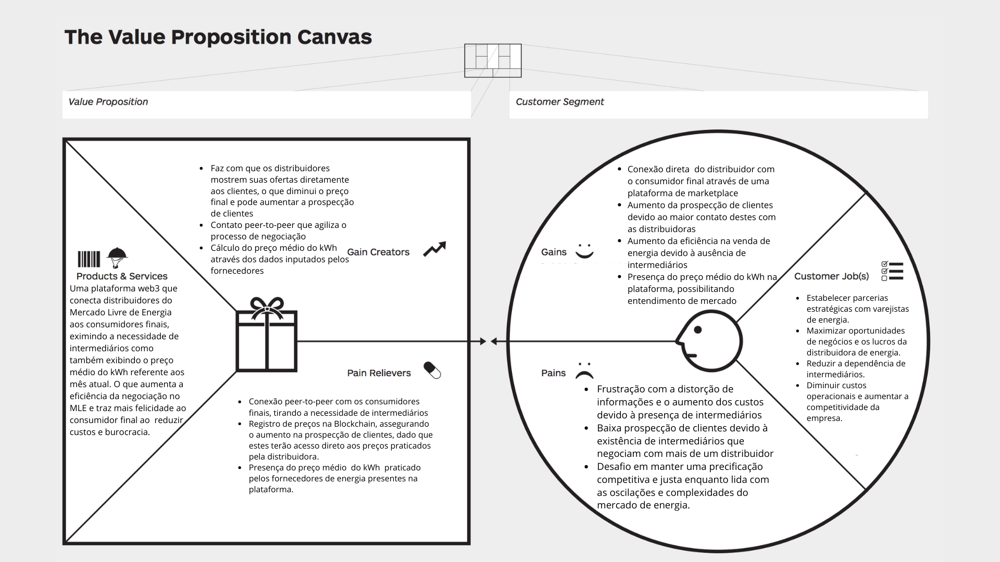

## BaoTrack
#### Integrantes:
- <a href="https://www.linkedin.com/in/davi-motta/">Davi Motta</a>
- <a href="https://www.linkedin.com/in/erik-batista-da-silva-455612215/">Erik Batista</a>
- <a href="https://www.linkedin.com/in/nicollas-isaac/">Nicollas Isaac</a>
- <a href="https://www.linkedin.com/in/rafaella-bianca-cavalcante/">Rafaella Cavalcante</a>
- <a href="https://www.linkedin.com/in/yan-m-coutinho/">Yan Coutinho</a>

## Sumário

[1. Introdução](#c1)

[2. Objetivos e Justificativa](#c2)

[3. Análise de Mercado e Desenvolvimento](#c3)

[4. Arquitetura da Solução](#c4)

[5. Conclusões e Próximos Passos](#c6)

[6. Referências](#c7)

## 1. Introdução
&emsp;A presente documentação introduz uma aplicação inovadora em blockchain, desenvolvida especificamente para transformar a maneira como os usuários acessam o Mercado Livre de Energia (MLE) no Brasil. Nossa solução visa não apenas facilitar a entrada de consumidores e empresas neste mercado dinâmico e econômico, mas também reduzir significativamente os custos associados à contratação de fornecedores de energia.

&emsp;Utilizando tecnologias de ponta como ChainLink, Hardhat, Next.js, Scaffold e Scroll, nossa plataforma em blockchain oferece um ecossistema descentralizado que permite a negociação direta entre consumidores e fornecedores de energia. Com isso, pretendemos desintermediar o processo de contratação no MLE, removendo as barreiras tradicionais e diminuindo as taxas que atualmente oneram os participantes deste mercado.

## 2. Objetivos e Justificativa

### 2.1 Objetivos Gerais

A solução em blockchain para o Mercado Livre de Energia (MLE) tem o objetivo geral de desburocratizar e democratizar o acesso à energia, visando um mercado mais competitivo, transparente e eficiente. Essa iniciativa busca facilitar a entrada de novos consumidores e empresas no MLE, minimizando as barreiras e os custos de transação. Além disso, almeja promover a negociação direta entre consumidores e fornecedores de energia, removendo intermediários e garantindo segurança e transparência nas transações por meio da tecnologia blockchain. O sistema proposto é descentralizado e autônomo, reduzindo os custos de energia para os consumidores e aumentando a competitividade do mercado ao incentivar a entrada de novos fornecedores. A promoção da sustentabilidade energética, por meio do incentivo ao consumo de energia renovável, também está entre os principais objetivos da plataforma.

### 2.2 Objetivos Específicos

Para atingir esses objetivos gerais, a solução em blockchain para o MLE propõe-se a:

1. **Facilitar o acesso dos consumidores ao MLE:** Os consumidores poderão registrar seu consumo energético mensal na plataforma, que então recomendará os fornecedores adequados às suas necessidades e exibirá o preço médio dos planos de energia correspondentes. Isso facilitará a comparação de opções e fornecerá um processo de compra simplificado e eficiente.
2. **Reduzir os custos de energia para os consumidores:** A plataforma eliminará intermediários, reduzindo as taxas cobradas e permitindo negociações diretas para melhores preços e condições.
3. **Promover a transparência no mercado de energia:** Todas as transações serão registradas na blockchain, assegurando um registro imutável e fornecendo informações detalhadas sobre a origem e tipo de energia consumida, além de permitir a avaliação do desempenho dos fornecedores.
4. **Aumentar a competitividade do mercado de energia:** A solução incentivará a entrada de novos fornecedores e a diversificação da matriz energética, fomentando a geração e o consumo de energia renovável, o que contribuirá para um mercado mais competitivo.
5. **Incentivar a sustentabilidade energética:** A plataforma promoverá o uso de energia renovável por meio de tarifas especiais e incentivos, educando os consumidores sobre seus benefícios e fomentando práticas de consumo consciente para reduzir o impacto ambiental.

### 2.3 Justificativa

&emsp;A implementação da solução BaoEnergy no Mercado Livre de Energia (MLE) do Brasil é justificada pela necessidade urgente de tornar o mercado de energia mais acessível, econômico e sustentável. O MLE atual enfrenta desafios significativos de transparência e eficiência, com consumidores e empresas muitas vezes sobrecarregados por custos elevados e processos burocráticos na contratação de energia. A falta de transparência nos preços e nos processos de contratação cria um ambiente propício a ineficiências e, potencialmente, práticas desleais.

&emsp;A BaoEnergy, com sua abordagem baseada em blockchain, propõe uma reforma estrutural neste cenário. Ao desintermediar o processo de contratação de energia, elimina-se uma camada significativa de custos e complexidade, permitindo que consumidores e fornecedores interajam diretamente em um ambiente seguro e transparente. Este acesso direto não só reduzirá os custos de energia para os consumidores, mas também aumentará a competitividade do mercado, incentivando a entrada de novos fornecedores e a adoção de energias renováveis.

&emsp;Além disso, a solução alinha-se com os objetivos globais de sustentabilidade, promovendo o uso de fontes de energia renováveis e apoiando a transição energética para um modelo mais limpo e verde. Em um momento em que a crise climática exige ações concretas e inovadoras, a BaoEnergy representa um passo significativo para um futuro energético mais sustentável e justo.

&emsp;Portanto, a justificativa para este projeto vai além da eficiência e economia, abraçando valores de sustentabilidade, equidade e transparência. Isso não apenas atende à demanda imediata por melhorias no MLE, mas também posiciona o setor energético brasileiro na vanguarda da inovação e da responsabilidade socioambiental. 

### 2.4 Proposta da Solução

A BaoEnergy propõe uma solução inovadora em blockchain para reformular o acesso ao Mercado Livre de Energia (MLE) no Brasil. Nossa abordagem visa simplificar a entrada de consumidores e empresas neste mercado, oferecendo uma plataforma descentralizada que permite a negociação direta entre consumidores e fornecedores de energia, eliminando intermediários e reduzindo custos.

#### Recursos e Benefícios:

- **Tecnologia Avançada:** Utilizando ferramentas como ChainLink, Hardhat, Next.js, Scaffold e Scroll, a BaoEnergy oferece um sistema robusto e seguro que garante a transparência e a eficiência das transações.
- **Acesso Facilitado:** Por meio do registro do consumo energético mensal, a plataforma recomenda fornecedores adequados e exibe preços médios, facilitando a escolha dos consumidores.
- **Custos Reduzidos:** A eliminação de intermediários no processo de contratação no MLE permite uma economia significativa nas taxas, tornando a energia mais acessível para todos.
- **Transparência Total:** Com todas as transações registradas na blockchain, garantimos um sistema imutável e transparente, onde a origem e o tipo de energia são claramente informados.
- **Mercado Competitivo:** A plataforma incentiva a entrada de novos fornecedores e promove a diversificação energética, contribuindo para um mercado mais competitivo e sustentável.
- **Compromisso com ESG:** A BaoEnergy está comprometida com práticas ambientais, sociais e de governança (ESG), incentivando o uso de energia renovável e promovendo um modelo de negócio ético e responsável, alinhado com os objetivos de desenvolvimento sustentável.
A proposta da BaoEnergy não é apenas tecnologicamente avançada, mas também alinhada com a necessidade de um mercado de energia mais justo, econômico e sustentável no Brasil, reforçando o compromisso com a sustentabilidade e a responsabilidade social.
&emsp;

## 3. Análise de Mercado e Desenvolvimento

### 3.1 Contexto da Indústria

&emsp; No Brasil, o Mercado Livre de Energia (MLE) está em um ponto crucial de transformação, oferecendo uma alternativa ao mercado regulado, onde consumidores de grande porte podem negociar energia diretamente com fornecedores, buscando condições mais vantajosas e flexíveis. Apesar de seu potencial para aumentar a competitividade e a eficiência, o MLE enfrenta desafios como a necessidade de maior transparência, inclusão e inovação tecnológica.

&emsp; A adoção de tecnologias disruptivas, como a blockchain, promete revolucionar este mercado, oferecendo processos mais eficientes, custos reduzidos, e uma transparência e confiabilidade aprimoradas nas transações. O crescente enfoque em práticas de ESG (Ambiental, Social e Governança) também está moldando o mercado, exigindo estratégias que alinhem o crescimento econômico com a sustentabilidade ambiental.

&emsp; Neste cenário, a BaoEnergy surge como um agente de inovação, utilizando a blockchain para facilitar o acesso ao MLE, minimizar as barreiras existentes e fomentar um ambiente energético mais equitativo e sustentável. A plataforma da BaoEnergy visa atender às demandas atuais por maior eficiência e transparência, ao mesmo tempo em que lidera a transição para um modelo energético mais renovável e sustentável, alinhado com as metas de desenvolvimento sustentável globais e as exigências do mercado energético brasileiro.

### 3.2 Análise das 5 Forças de Porter

### 3.3 Análise SWOT

### 3.5 Personas & User Stories 

&emsp; Tanto as personas quanto as user stories desempenham papéis cruciais na construção de um MVP (Minimum Viable Product - Produto Mínimo Viável). As personas fornecem uma compreensão profunda dos usuários-alvo, ajudando as equipes de desenvolvimento a focar nos recursos e funcionalidades mais relevantes e significativas para esses usuários. Isso é essencial para garantir que o MVP atenda às necessidades reais do mercado e dos clientes desde o início.

&emsp; Por sua vez, as user stories detalham as funcionalidades específicas do produto a partir da perspectiva do usuário, o que é fundamental para o processo de desenvolvimento ágil. Elas orientam a equipe na priorização das tarefas e na definição do escopo do MVP, permitindo que o desenvolvimento ocorra de maneira iterativa e focada nas necessidades do usuário.

&emsp; Portanto, tanto as personas quanto as user stories desempenham um papel crucial na identificação, definição e priorização dos requisitos do MVP, garantindo que ele seja viável, centrado no usuário e capaz de entregar valor desde o lançamento inicial. Por isso, foram criadas duas personas que delimitam os público-alvos da nossa solução, sendo uma delas uma Gerente de uma empresa de distribuição de energia, atuante no Mercado Livre de Energia (MLE), e a outra um  de um Diretor de Facilities de uma empresa que contrata energia através do MLE.

 
Figura 03 - Persona Consumidor  
</img>
Fonte: Elaborado pelos autores.

 
Figura 04 - Persona Distribuidor  
</img>
Fonte: Elaborado pelos autores.

### 3.5 Value Proposition Canvas

&emsp; O Value Proposition Canvas é uma ferramenta estratégica usada para desenvolver e analisar a proposta de valor de um produto ou serviço. Criado por Alex Osterwalder, o canvas ajuda a garantir que a oferta de uma empresa esteja alinhada com as expectativas e as necessidades dos clientes.

&emsp; O canvas é dividido em duas partes principais: o perfil do cliente e a proposta de valor. O perfil do cliente é focado em entender os trabalhos que o cliente precisa realizar, as dores que eles querem aliviar e os ganhos que eles buscam atingir. De outro lado, a proposta de valor concentra-se nos produtos e serviços que uma empresa oferece, destacando como eles aliviam as dores do cliente e criam os ganhos desejados. Tendo isto em mente, foram construídos dois Canvas da Proposta de Valor que visam demonstrar o valor gerado para as duas personas do projeto. O primeiro destes demonstra o valor agregado ao consumidor, enquanto o segundo, ao distribuidor de energia do Mercado Livre de Energia.

 
Figura 01 - Value Proposition Canvas - Persona Consumidor  
</img>
Fonte: Elaborado pelos autores.

 
Figura 02 - Value Proposition Canvas - Persona Distribuidor  
</img>
Fonte: Elaborado pelos autores.

&emsp; Tendo em vista os Canvas acima apresentados, torna-se notório que a BaoEnergy apresenta uma proposta inovadora para o Mercado Livre de Energia (MLE) no Brasil, com uma plataforma blockchain que promove a conexão direta entre consumidores e fornecedores de energia. Esta solução busca eliminar intermediários, tornando o processo mais eficiente e econômico. A ênfase na transparência dos preços e a presença de indicadores de energia renovável destacam o compromisso com a sustentabilidade e práticas de ESG.

&emsp; A plataforma permite que os consumidores registrem seu consumo energético e recebam recomendações personalizadas de fornecedores, juntamente com informações sobre o preço médio do kWh, facilitando a tomada de decisões de compra com base em dados concretos. Além disso, a possibilidade de usar o DREX para pagamentos simplifica ainda mais o processo, evitando taxas bancárias adicionais.

&emsp; A BaoEnergy mira tanto nos ganhos quantificáveis, como redução de custos e aumento da eficiência nas vendas, quanto nos benefícios intangíveis, como a melhoria da percepção do mercado e a facilidade de acesso a energia limpa. Ao mesmo tempo, a solução visa aliviar as dores comuns dos participantes do MLE, como os altos custos operacionais e a complexidade na negociação e contratação de energia.

&emsp; Em resumo, a BaoEnergy se posiciona como um agente de mudança no MLE brasileiro, oferecendo uma solução que não apenas melhora a eficiência e transparência do mercado, mas também o alinha com as exigências contemporâneas de sustentabilidade e responsabilidade corporativa.

### 3.6 Regras de Negócios

## 4. Arquitetura da Solução

### 4.1 Visão Geral da Arquitetura

### 4.2 Tecnologias Utilizadas

### 4.3 Diagrama de Blocos

## 5. Conclusões e Próximos Passos

Tendo em vista o projeto apresentado acima, 

## 6. Referências
